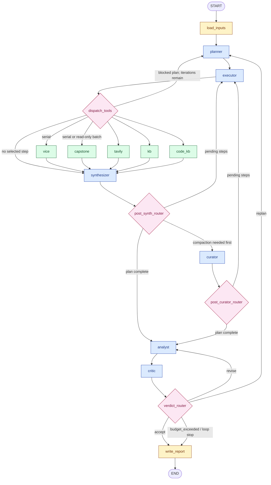

# C64-RE Agent — LangGraph Implementation Diagram

This document describes the implemented graph in `graph/build.py`, its state,
execution policy, model roles, and two knowledge stores. Reviewed against the
working tree on 2026-09-19. `config/llm.json` is the source of truth for configured
models; the model table below is a snapshot.

## 1. High-level graph topology

The graph registers 13 nodes. Diamonds below represent conditional routing
functions, not additional graph nodes.



Blue nodes coordinate research; some paths are deterministic and need no LLM
call. Green nodes expose tools, including Code KB modes that can call LLMs.
VICE always runs serially. Vision is a helper inside the VICE screenshot path,
not a separately registered graph node.

## 2. Shared state schema

`graph/state.py` defines `C64State(TypedDict, total=False)`. Nodes return partial
updates. Fields without a reducer replace their previous value.

| Fields | Purpose / merge behavior |
|---|---|
| `game`, `question`, `dump_path`, `partial_asm_path`, `text_dir`, `asm_dir`, `asm_files` | Research inputs; explicit `asm_files` overrides automatic game-based file selection. |
| `run_id`, `run_started_at`, `run_completed_at` | Identity and timing of one runner invocation. |
| `require_vice_approval`, `approved_mutation_steps`, `approve_all_vice_mutations` | Approval policy for emulator mutations. |
| `kb_handle`, `code_kb_handle` | Handles to the separate general and code stores; the code handle can be absent. |
| `plan`, `current_step_id`, `current_step_ids`, `plan_blocked` | Plan, serial selection, concurrent batch selection, and blocked-plan signal. |
| `tool_results` | Custom `reduce_tool_results` reducer merges results and preserves execution identities. |
| `tool_call_stats` | `merge_tool_call_stats` keeps exact tool counters independently of retained payloads. |
| `candidate_answer`, `verdict` | Latest evidence-backed answer and critic decision. |
| `history` | Additive critic-verdict history. |
| `kb_digest`, `code_kb_digest` | Question-relevant evidence and separate excerpts from selected assembly documents. |
| `last_kb_event_count` | Previous substantive-fact count, used to detect progress between verdicts. |
| `synth_processed_result_ids`, `synth_processed_count` | Stable processed-result identities plus the legacy migration cursor. |
| `iteration`, `replan_count`, `revise_count`, `termination_reason` | Loop accounting and termination metadata. |
| `budget_used`, `tokens_used`, `llm_usage` | Additive estimated USD, total input/output tokens, and per-call usage records. |
| `budget_reservation_exhausted` | Signals that no role in an invocation chain fits the remaining reservation budget. |
| `messages` | LangChain transcript merged with `add_messages`. |

Tool state retains at most 96 rows with bulky payloads. Older rows retain a
compact status ledger so dependencies and retry accounting remain correct.
Once results are persisted, the synthesizer also replaces their bulky state
payloads with compact records carrying KB event IDs. The full evidence remains
queryable in the general KB. USD and token totals are separate units.

## 3. Node and interface responsibilities

| Registered node | Implementation / responsibility |
|---|---|
| `load_inputs` | Opens the stores; ingests available dump, assembly, and notes; builds initial evidence digests. |
| `planner` | Produces a bounded plan with tool arguments, hypotheses, and explicit `depends_on` relationships. |
| `executor` | Selects runnable steps; dispatches a concrete read-only batch when possible; repairs or enriches arguments when needed. |
| `vice` | `vice_mcp_node`: live emulator inspection and supported mutations through VICE MCP; screenshot analysis can invoke the vision role. |
| `capstone` | Static 6502/6510 dump analysis, including disassembly and code-pattern analysis. |
| `tavily` | Web searches using the configured source restrictions. |
| `kb` | `kb_query_node`: queries the general evidence store. |
| `code_kb` | Queries and extends the separate layered code-comprehension store; see §9. |
| `synthesizer` | Persists tool results, extracts structured facts, refreshes evidence, and compacts persisted result payloads in graph state. |
| `curator` | Summarizes uncompacted tool-result evidence and records the covered event IDs without deleting the original log. |
| `analyst` | Produces the candidate answer, citations, confidence, and unresolved questions from available evidence. |
| `critic` | Reviews the answer, records a verdict, and applies decision guardrails. |
| `write_report` | Writes a versioned Markdown report, refreshes `report.md`, archives the turn, and records a run summary. |

Most nodes live in `graph/nodes.py`; `code_kb` lives in
`graph/code_kb_node.py`. Store writes also occur during ingestion, code analysis,
curation, and reporting, not only during synthesis.

## 4. Tool selection, retries, and routing

`graph/plan_utils.py` owns deterministic step status and dependency policy.
A successful prerequisite satisfies dependencies. A failed prerequisite does
not, even when it is terminal. A retryable step becomes terminal after two
failed attempts; a permanent failure is terminal immediately.

The executor can select up to four fresh, concrete, dependency-ready read-only
steps. Capstone, Tavily, general-KB queries, and the explicit Code KB read-mode
allowlist qualify. VICE, Code KB writes/LLM analysis, and retry or argument
enrichment paths remain serial. `dispatch_tools` emits LangGraph `Send` objects
for a batch; reducer-backed results merge before the shared synthesizer runs.

| Router | Decision order |
|---|---|
| `dispatch_tools` / `route_tool` | Dispatch the selected batch or serial tool. With no selected step, a blocked plan returns to `planner` while `iteration < 12`; otherwise route to `synthesizer`. |
| `post_synth_router` | First curate if estimated uncompacted tool-result tokens exceed 40,000; otherwise return to `executor` for pending steps, or proceed to `analyst`. |
| `post_curator_router` | Return to `executor` for pending steps; otherwise proceed to `analyst`. |
| `verdict_router` | Check reservation, spending, token, iteration, and dead-end stops before honoring `accept`, `revise`, or `replan`. |

The curator threshold measures **uncompacted tool-result evidence**, not total
KB file size or a model context-window limit. The router falls back to an
estimate of 1,000 tokens per retained result if KB statistics are unavailable.

## 5. Critic loop and termination

`accept` routes to the report, `revise` returns to the analyst, and `replan`
returns to the planner for more tool work. Blocking `suggested_steps` convert an
`accept` or `revise` decision into `replan`. Non-blocking suggestions belong in
`optional_followups`.

Current bounds in `graph/plan_utils.py` are 12 planner iterations, 12 steps per
plan, two failed attempts per step, and four concurrent read-only steps. After
two consecutive `revise` verdicts, another proposed revision is forced to
`accept`; remaining concerns stay in the critique. This bounds editorial
revision and does not establish that every research question was resolved.

The router uses the `budget_exceeded` edge for any of these stop conditions:

- No invocation role fits the remaining LLM budget reservation.
- Estimated spending reaches the USD cap (default `$5`; override with
  `C64RE_USD_BUDGET` or `defaults.usd_budget`).
- Total input/output tokens reach the token cap (default `3,000,000`; override
  with `C64RE_TOKEN_BUDGET` or `defaults.token_budget`).
- The planner iteration count reaches 12.
- Two consecutive critic verdicts request replanning and the latest verdict
  reports no growth in substantive KB facts since the previous verdict.

Cost estimates use configured pricing. Token accounting remains available for
unpriced models. `RECURSION_LIMIT` is derived from the loop bounds; runners
normalize truncated state if LangGraph still raises `GraphRecursionError`.
A report can therefore describe an incomplete investigation rather than an
accepted answer.

## 6. Persistence and continuation

Default per-game storage is under `sessions/<game-slug>/`:

```text
sessions/<game-slug>/
├── kb/
│   ├── kb.json                 # append-only JSONL evidence log
│   ├── kb.sqlite               # derived query tables
│   └── vectors.sqlite          # optional semantic cache
├── code_kb/
│   ├── code_kb.json            # separate append-only JSONL code log
│   └── code_kb.sqlite          # code tables and annotations
├── checkpoint.sqlite          # CLI LangGraph checkpoints
├── report_<timestamp>_<run>.md # versioned report
├── report.md                  # latest report
└── turns.jsonl                # archived turns
```

Both `.json` store logs contain JSON Lines. SQLite query projections and graph
checkpoints serve different purposes; neither knowledge store is the graph's
checkpointer.

| Entry point | Checkpoint behavior |
|---|---|
| CLI (`main.py`) | Opens a per-game `SqliteSaver` in a context manager; falls back to `MemorySaver` with a warning if SQLite checkpoint support is unavailable. |
| Streamlit runner (`tools/agent_runner.py`) | Uses cached compiled graphs with `MemorySaver`; the review variant interrupts after each planner pass. Live checkpoints are process-local; evidence and turn archives are durable. |
| LangGraph Studio (`langgraph.json`) | Loads `graph/build.py:graph`, compiled without a checkpointer so the server can supply its own. |

The CLI's default thread ID is `<game-slug>-<question-hash>`, with the first
eight hexadecimal characters of the question's SHA-1. `--thread-id` overrides
it. A different question gets a fresh thread while sharing the game's KB.
Reinvoking the CLI supplies inputs and re-enters the graph over saved state;
it is not a guarantee of resuming exactly inside an interrupted node or avoiding
repeat calls.

`C64RE_WORKSPACE_DIR` and `C64RE_SESSIONS_DIR` can relocate session storage.
The CLI's default `./asm_dir` and `./text_dir` remain relative to its working
directory. Set path/config overrides before startup because application modules
snapshot these paths at import time.

## 7. Graph construction

`graph/build.py:build_graph()` registers the nodes, adds the linear and tool
edges, and installs these conditional mappings:

| Source | Routing function | Returned label → destination |
|---|---|---|
| `executor` | `dispatch_tools` | `vice`, `capstone`, `tavily`, `kb`, `code_kb`, `synthesizer`, `planner` → same-named node; batches use `Send`. |
| `synthesizer` | `post_synth_router` | `curate` → `curator`; `executor` → `executor`; `analyst` → `analyst`. |
| `curator` | `post_curator_router` | `executor` → `executor`; `analyst` → `analyst`. |
| `critic` | `verdict_router` | `accept` / `budget_exceeded` → `write_report`; `revise` → `analyst`; `replan` → `planner`. |

The module exposes the Studio entry point as:

```python
from graph.build import build_graph

graph = build_graph().compile()
graph.name = "c64re_agent"
```

Other runners compile the same builder with their checkpointer, as described
in §6. The topology in §1 includes the no-step and blocked-plan paths as well
as the normal tool loop.

**Routing note:** The curator gate and the more-steps gate are merged into one
`post_synth_router`. They are not separate conditional edges or registered
nodes. After curation, `post_curator_router` checks for remaining steps.

## 8. LLM configuration and roles

`graph/llm.py` reads `config/llm.json`, with YAML supported as a fallback.
`C64RE_CONFIG_DIR` can select another configuration directory. The current
working-tree JSON assigns:

| Role | Provider | Configured model ID | Maximum output tokens |
|---|---|---|---|
| Planner | `anthropic` | `claude-opus-5` | 8,192 |
| Executor | `openai` | `gpt-5.6` | 4,096 (default) |
| Synthesizer | `grok` | `grok-4.6` | 4,096 (default) |
| Analyst | `gemini` | `gemini-pro-latest` | 8,192 |
| Critic | `gemini` | `gemini-pro-latest` | 8,192 |
| Curator | `grok` | `grok-4.6` | 4,096 (default) |
| Vision helper | `gemini` | `gemini-pro-latest` | 2,048 |

These are configured identifiers, not provider-availability checks.
`gemini-pro-latest` is a floating alias, not a pinned model release. Role
fallbacks can use another configured model, so the run's `llm_usage` records
identify actual calls. Deterministic executor paths need no model call.

The wrapper uses configured OpenAI-compatible endpoints and environment-based
credentials. Shared invocation helpers apply budget reservations, usage
accounting, JSON contract validation, and role fallback chains. Native
structured output is optional; `defaults.structured_output` is currently
`false`. Defaults also specify a 120-second timeout and three retries.

## 9. Code KB interface and SQL column names

`code_kb` is a planner tool backed by a store separate from the general `kb`.
Layer 0 parses assembly and records static evidence. Layer 1 adds routine
annotations, Layer 2 groups routines into behavior hypotheses, and Layer 3
adds adversarial critiques. Read modes expose routines, cross-references,
data references, pseudocode, documents, annotations, and schema information.
Modes such as `disasm`, `annotate`, `layer2`, `layer3`, and `export` perform
additional work and remain outside the parallel read-only allowlist.

Use `{"mode": "schema"}` to inspect the supported SQL schema before querying
unfamiliar tables. In particular:

| Table | Reference columns |
|---|---|
| `code_xrefs` | `src_addr` = source instruction address; `dst_addr` = call/jump/branch target. |
| `code_data_refs` | `src_addr`, `dst_addr`, plus access and addressing-mode metadata. |
| `code_smc_sites` | `src_addr`, `dst_addr`, plus mnemonic, operand, and SMC classification. |

A query for control-flow references into `$4000`–`$47FF` is:

```sql
SELECT *
FROM code_xrefs
WHERE dst_addr BETWEEN 16384 AND 18431
ORDER BY dst_addr
LIMIT 200;
```

For a planner step, put this in `args.sql` with `args.mode = "sql"`.
SQL mode rejects write/DDL statements and tries the original query first.
If execution fails, its compatibility fallback can repair known naming errors,
including `xrefs` → `code_xrefs`, `source_addr` → `src_addr`, and
`target_addr` → `dst_addr`. Rewrites are case-insensitive and preserve
single-quoted string literals, including escaped quotes. A successful query
using legitimate SQL aliases is returned without a rewrite.

Successful fallback results include `sql_rewrites_applied` metadata. If both
attempts fail, the tool returns the error and schema hint. The planner prompt
also supplies the canonical `code_xrefs(src_addr, dst_addr, kind, ...)` names.
`tests/test_code_kb_sql.py` covers the reported missing-`target_addr` query,
qualified uppercase names, string-literal preservation, and valid SQL aliases.

## 10. Source map

| Source | Responsibility |
|---|---|
| `graph/build.py` | Registered nodes, edges, and Studio entry point. |
| `graph/state.py` | State schema, result compaction, and reducers. |
| `graph/routers.py`, `graph/plan_utils.py` | Routing, dependencies, retries, concurrency, and loop bounds. |
| `graph/nodes.py`, `graph/prompts.py` | Research nodes, invocation helpers, and role/tool instructions. |
| `graph/code_kb_node.py`, `code_kb/` | Code tool modes, SQL recovery, parsing, annotations, and code persistence. |
| `graph/llm.py`, `graph/usage.py`, `config/llm.json` | Model construction, configuration, and usage accounting. |
| `memory/` | General evidence store, retrieval, redaction, and optional semantic indexing. |
| `tools/vice_mcp.py`, `tools/c64_disasm.py` | Emulator and static-disassembly interfaces. |
| `main.py`, `tools/agent_runner.py`, `langgraph.json` | CLI, UI, and Studio execution. |
| `c64re_agent/paths.py` | Workspace, session, and configuration path resolution. |
| `tests/test_code_kb_sql.py`, `tests/test_parallel_fanout.py` | Regression coverage for SQL recovery and concurrent dispatch. |
