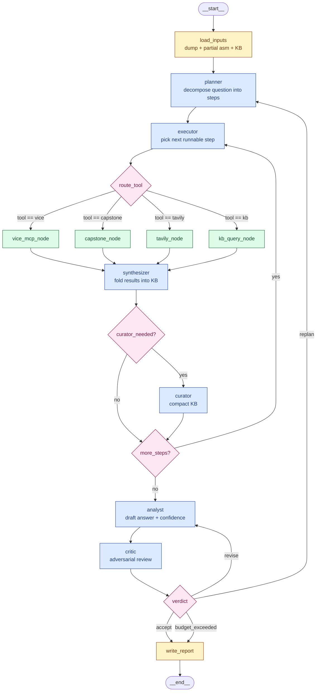
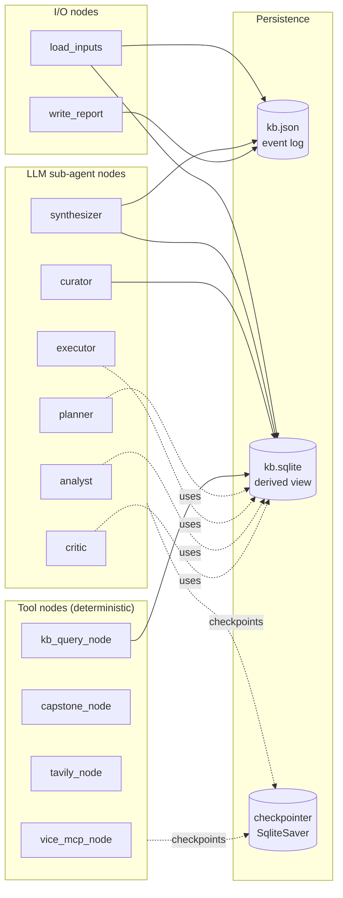
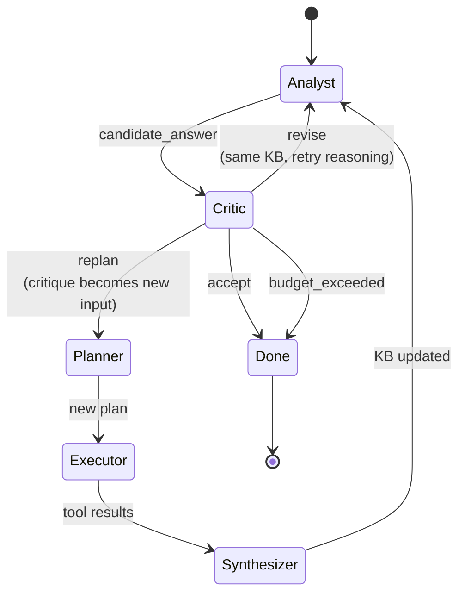
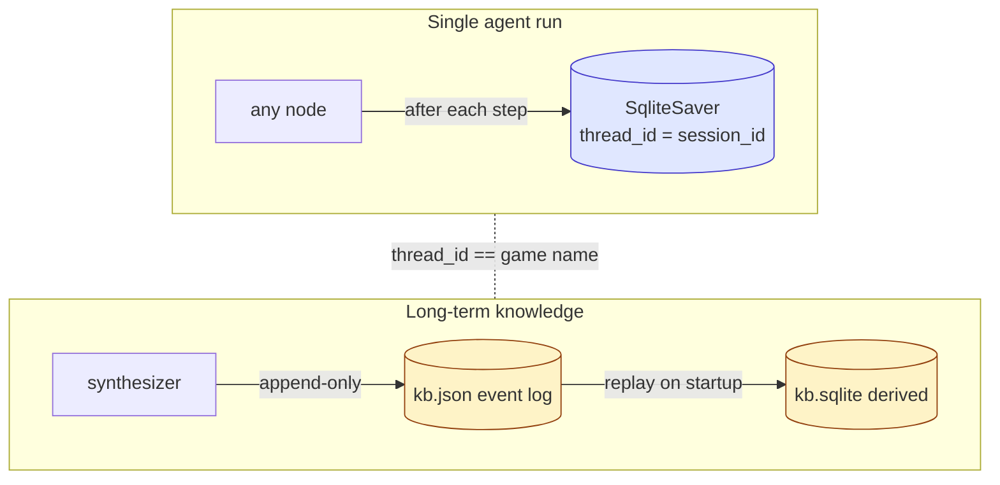
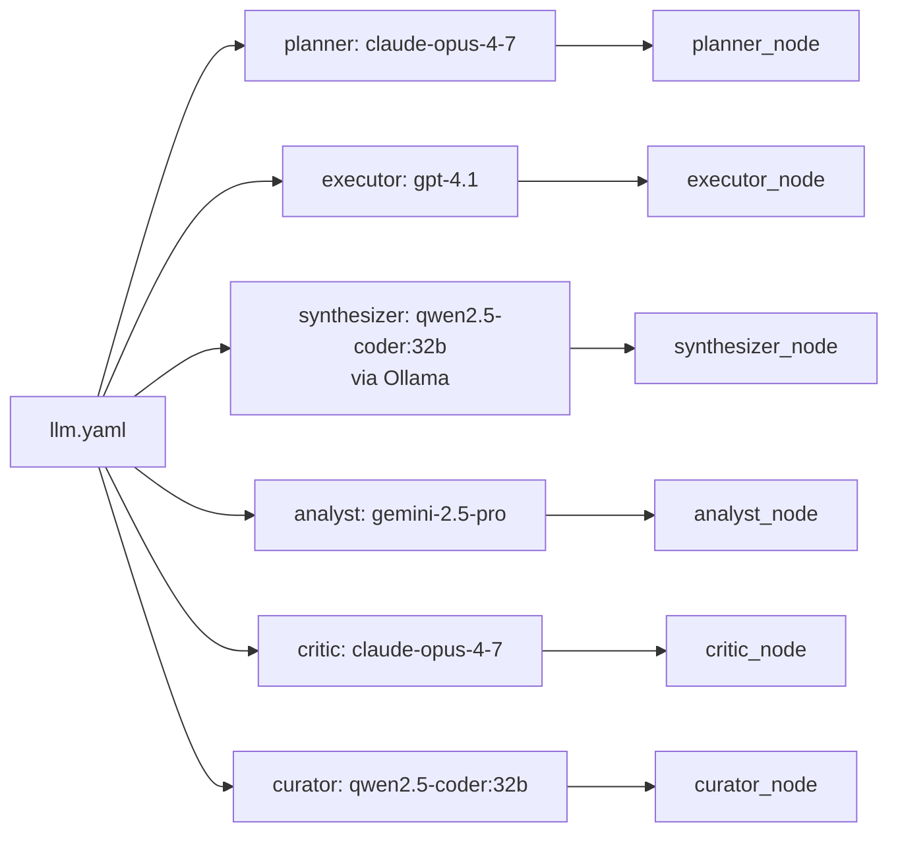

# C64-RE Agent — LangGraph Implementation Diagram

This document maps the C64 Reverse Engineering Agent onto a concrete **LangGraph** `StateGraph`. It shows the node topology, the shared state schema, the conditional routing logic, and how persistence/checkpointing wires up so the agent is resumable.

---

## 1. High-level graph topology



**Legend:** blue = LLM-driven sub-agent · green = tool node · yellow = I/O · pink = conditional edge.

---

## 2. Shared state schema

LangGraph passes a single typed dict between nodes. Reducers control how each field merges across updates.

```python
from typing import Annotated, Literal, TypedDict
from operator import add
from langgraph.graph.message import add_messages

class C64State(TypedDict):
    # --- inputs (set once at LOAD) ---
    game: str
    question: str
    dump_path: str
    partial_asm_path: str | None

    # --- working memory ---
    kb_handle: str                              # path to kb.json + kb.sqlite
    plan: list[dict]                            # full plan from planner
    current_step_id: str | None                 # which step the executor picked
    tool_results: Annotated[list[dict], add]    # appended each tool call

    # --- analysis ---
    candidate_answer: dict | None               # analyst output
    verdict: dict | None                        # critic output
    history: Annotated[list[dict], add]         # all verdicts, for dead-end detection

    # --- control ---
    iteration: int
    replan_count: int
    budget_used: float                          # USD or tokens, depending on config

    # --- transcript (LangChain message log) ---
    messages: Annotated[list, add_messages]
```

---

## 3. Node-by-node responsibilities



| Node | LangGraph type | Notes |
|---|---|---|
| `load_inputs` | plain function | Reads dump, optional asm, hydrates KB. Idempotent on re-runs. |
| `planner` | LLM node | Calls Claude (per `llm.yaml`). Returns `plan: list[Step]`. |
| `executor` | LLM node | Picks next step whose deps are done. Emits a `ToolCall`. |
| `route_tool` | conditional edge | Pure function on `current_step.tool`. No LLM. |
| `vice_mcp_node` | tool node | MCP client → live VICE emulator. |
| `capstone_node` | tool node | In-process Capstone disassembly of dump bytes. |
| `tavily_node` | tool node | Web search, restricted to retro sources. |
| `kb_query_node` | tool node | SQL queries against `kb.sqlite`. |
| `synthesizer` | LLM node | The **only** writer of long-term KB facts. |
| `curator` | LLM node | Triggered when KB > threshold tokens. Compacts. |
| `analyst` | LLM node | Drafts answer using only KB-cited evidence. |
| `critic` | LLM node | Returns `accept` / `revise` / `replan` / `budget_exceeded`. |
| `write_report` | plain function | Emits Markdown report + final transcript. |

---

## 4. Conditional edges (the routing logic)

```python
# Tool dispatch after the executor picks a step.
def route_tool(state: C64State) -> Literal["vice", "capstone", "tavily", "kb"]:
    step = next(s for s in state["plan"] if s["id"] == state["current_step_id"])
    return step["tool"]

# Decide whether the curator needs to run.
def curator_needed(state: C64State) -> Literal["curate", "skip"]:
    return "curate" if kb_size_tokens(state["kb_handle"]) > 60_000 else "skip"

# Are there more unfinished steps in the plan?
def more_steps(state: C64State) -> Literal["continue", "analyze"]:
    done = {r["step_id"] for r in state["tool_results"]}
    pending = [s for s in state["plan"] if s["id"] not in done]
    return "continue" if pending else "analyze"

# The critic's verdict drives the outer loop.
def verdict_router(state: C64State) -> Literal["accept", "revise", "replan", "budget_exceeded"]:
    v = state["verdict"]
    if state["budget_used"] >= BUDGET_CAP:        return "budget_exceeded"
    if state["iteration"]   >= MAX_ITERS:         return "budget_exceeded"
    if dead_end_detected(state["history"]):       return "budget_exceeded"
    return v["decision"]                          # accept | revise | replan
```

---

## 5. The critic loop — zoomed in

This is where most of the agent's "thinking" time is spent. It's worth showing on its own:



- **`revise`** is cheap: only the Analyst re-runs against the existing KB.
- **`replan`** is expensive: triggers new tool calls. Capped by `replan_count`.
- **Dead-end detection** kicks in when two consecutive `replan` verdicts add zero new KB facts — prevents infinite loops.

---

## 6. Persistence & resumability

LangGraph's checkpointer + the agent's own KB give you **two layers** of durability:



```python
from langgraph.checkpoint.sqlite import SqliteSaver

checkpointer = SqliteSaver.from_conn_string("sessions/checkpoints.sqlite")
graph = builder.compile(checkpointer=checkpointer)

# Resume by passing the same thread_id (we use the game slug)
config = {"configurable": {"thread_id": "boulder-dash"}}
result = graph.invoke({"game": "Boulder Dash", "question": "..."}, config)
```

**Resume semantics:**
1. LangGraph replays the checkpoint → graph state is restored.
2. `load_inputs` sees an existing `kb.json` for the game → replays it into a fresh `kb.sqlite`.
3. Execution continues from the last successful node — no tool calls re-run.

---

## 7. Graph construction (skeleton)

```python
from langgraph.graph import StateGraph, START, END

builder = StateGraph(C64State)

# Nodes
builder.add_node("load_inputs",   load_inputs)
builder.add_node("planner",       planner_node)
builder.add_node("executor",      executor_node)
builder.add_node("vice",          vice_mcp_node)
builder.add_node("capstone",      capstone_node)
builder.add_node("tavily",        tavily_node)
builder.add_node("kb",            kb_query_node)
builder.add_node("synthesizer",   synthesizer_node)
builder.add_node("curator",       curator_node)
builder.add_node("analyst",       analyst_node)
builder.add_node("critic",        critic_node)
builder.add_node("write_report",  write_report)

# Linear segments
builder.add_edge(START, "load_inputs")
builder.add_edge("load_inputs", "planner")
builder.add_edge("planner", "executor")

# Tool dispatch fan-out
builder.add_conditional_edges("executor", route_tool, {
    "vice": "vice", "capstone": "capstone",
    "tavily": "tavily", "kb": "kb",
})
for tool in ["vice", "capstone", "tavily", "kb"]:
    builder.add_edge(tool, "synthesizer")

# Curator gate
builder.add_conditional_edges("synthesizer", curator_needed, {
    "curate": "curator", "skip": "executor_or_analyst",  # see next edge
})
# Effectively: after curator OR skip, decide whether to loop or analyze
builder.add_conditional_edges("curator", more_steps, {
    "continue": "executor", "analyze": "analyst",
})
builder.add_conditional_edges("synthesizer", more_steps, {
    "continue": "executor", "analyze": "analyst",
}, then="curator")  # pseudo; in practice you'd merge curator_needed + more_steps

# Outer critic loop
builder.add_edge("analyst", "critic")
builder.add_conditional_edges("critic", verdict_router, {
    "accept":           "write_report",
    "revise":           "analyst",
    "replan":           "planner",
    "budget_exceeded":  "write_report",
})
builder.add_edge("write_report", END)

graph = builder.compile(checkpointer=checkpointer)
```

> ⚠️ The `curator_needed` + `more_steps` pair is shown as two separate conditional edges for clarity. In real code you'd merge them into a single router function returning one of `{"curate", "executor", "analyst"}` so the graph stays a clean DAG-with-loops.

---

## 8. Where each `llm.yaml` agent lands



Each LLM node is a thin wrapper:

```python
def make_llm_node(role: str, prompt_template: str):
    cfg = LLM_CONFIG["agents"][role]
    client = openai_compatible_client(cfg["provider"])
    def node(state: C64State) -> dict:
        msgs = render_prompt(prompt_template, state)
        resp = client.chat.completions.create(
            model=cfg["model"],
            temperature=cfg["temperature"],
            messages=msgs,
        )
        return parse_role_output(role, resp)
    return node
```

---

## 9. What the runtime actually feels like

A typical session for *"Where is the lives counter in Boulder Dash?"*:

1. `load_inputs` — dump in, partial asm in, fresh KB.
2. `planner` — emits 5 steps: scan zero page (Capstone), search for `INC`/`DEC` near `$D021` writes, set VICE breakpoint when player dies, query Tavily for known maps, cross-ref.
3. Loop: `executor → capstone → synthesizer` × 2, then `executor → vice → synthesizer`.
4. `analyst` — proposes `$2A` as the lives byte, confidence 0.55.
5. `critic` — rejects: "no dynamic confirmation that `$2A` decreases on death." → `replan`.
6. `planner` — adds a step: trigger death in VICE, watch `$2A`.
7. Loop runs once more, KB now contains the observed decrement.
8. `analyst` — confidence 0.92, evidence cites events `e_017` and `e_023`.
9. `critic` — `accept`. → `write_report`.

Total LangGraph nodes traversed: ~14. All checkpointed; killing the process at any point and restarting with the same `thread_id` resumes mid-loop.

---

## 10. Files to add to the spec repo

```
c64re-agent/
├── graph/
│   ├── __init__.py
│   ├── state.py           # C64State TypedDict
│   ├── nodes.py           # all node functions
│   ├── routers.py         # route_tool, verdict_router, etc.
│   └── build.py           # builder + compile + checkpointer wiring
└── main.py                # thin CLI: parses args → graph.invoke(...)
```

That's the full LangGraph picture. If you want, the next step is generating the actual `graph/build.py` with all the wiring filled in and stub nodes that print their inputs — say the word.
